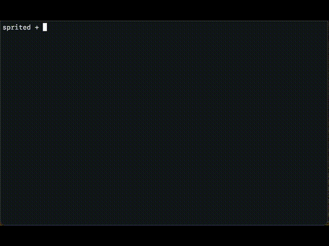

# sprited

Tool to create, edit, animate & manipulate sprites.



## Usage

```
usage:

  Display sprite(s):

    sprited <spritefile.json> display
    sprited <spritefile.json> invdisplay

  Playback sprite animation:

    sprited <spritefile.json> animate <milliseconds> <loopcnt>
    sprited <spritefile.json> invanimate <milliseconds> <loopcnt>

  Rotate sprite to specified degrees:

    sprited <spritefile.json> rotate360 <degree>

  Create 360 degree rotation sprite sheet:

    sprited <spritefile.json> rotate360 <degree increments>

  Flip (mirror) horizontally:

    sprited <spritefile.json> fliph

  Flip (mirror) vertically:

    sprited <spritefile.json> flipv

  Convert to C horizontal-mapped byte array:

    sprited <spritefile.json> tobytesh

  Convert to C vertical-mapped byte array:

    sprited <spritefile.json> tobytesv
```

## Creating and editing

`sprited` operates on JSON files that describe one or more sprites. The file
has the following structure:

```JSON
[
  {
    "name": "Domino Cat",
    "width": 32,
    "height": 32,
    "pixels": [
      "................................",
      "................................",
      "......X.........................",
      ".....XXX........XXX.............",
      ".....XXXX......XXXX.............",
      ".....XXXXX....XXXXX.............",
      ".....XXXXXXXXXXXXXX.............",
      ".....XXXXXXXXXXXXXX.............",
      ".....XX...XXX...XXX.............",
      "....XXX.X.XXX.X.XXX.............",
      "...XXXX...XXX...XXXX............",
      "....XXXXXXX.XXXXXXX.............",
      ".....XXXXXXXXXXXXX......XXX.....",
      "......XXXX..XXXXX......XXXXXX...",
      "........XXXXXXXX......XXXXXXXX..",
      ".......X........X....XXXXXXXXXX.",
      "......XXXX...XXXX....XXXXXXXXX..",
      "......XXXXXXXXXXXX...XXXXXXXX...",
      "......XXXXXXXXXXXXX...XXXXXXXX..",
      "......XXXXXXXXXXXXXX...XXXXXXXX.",
      "......XXXXXXXXXXXXXXX...XXXXXXX.",
      ".......XXXXXXXXXXXXXXX..XXXXXXX.",
      "........XXXXXXXX.XXXXXX.XXXXXXX.",
      "........X.XXXXXX.XXXXXX.XXXXXXX.",
      "........XX..XXXX.XXXXXX.XXXXXXX.",
      "........XXX..XX.XXXXXXX.XXXXXXX.",
      "........XXX.XXX.XXXXXXX.XXXXXX..",
      "........XXX.XXX.XXXXXXX.XXXXX...",
      "........XXX.XXX.XXXXXXXXXXXX....",
      ".......XX.X.XXX.XXXXX.XXXXX.....",
      ".......X.X.X.XX.XXXXX.XXXX......",
      "................................"
    ]
  }
]
```

The file is always an array of objects, the above example shows an array with
one objeft element.


## Displaying sprites

The contents of a sprite file can be displayed on the screen with `sprited
<spritefile.json> display`. Some sprites look better / are meant to be
inverted, so an `invdisplay` command is also provided.


## Animations

A file containing more than one sprite can be played back as an animation using
`sprited <spritefile.json> animate <milliseconds> <loopcnt>` where
`milliseconds` is the delay between frames and the animation will be
looped `loopcnt` times. As with displaying sprites, animations can be inverted
by using the `invanimate` command.


## Rotating a sprite

`sprited <spritefile.json> rotate <degree>` can be used to rotate a sprite a
specific angle. The output will be a new sprite file with the rotated sprite.

The below is the output of `sprited <file> rotate 90`:

```JSON
[
  {
    "name": "frame_01_90_deg",
    "width": 32,
    "height": 32,
    "pixels": [
      "................................",
      "...............X...XXXXXXX......",
      "..............XXX.XXXXXXXXX.....",
      ".............XXXXXXXXXXXXXXX....",
      ".............XXXXXXXXXXXXXXXX...",
      "............XXXXXXXXXXXXXXXXXX..",
      "............XXXXXXXXXXXXXXXXXXX.",
      "............XXXXXXXXXXXXXXXXXXX.",
      ".............XXXXXXX........XXX.",
      "..............XXXXX...XXXXXXXXX.",
      "...............XXX...XXXXXXXX...",
      "....................XXXXXXXXXXX.",
      "..........X........XXXXXXXXXXXX.",
      "...XXXXXXXXX......XXXXXXXXXXXXX.",
      "...XXXXXXXXXX....XXXXXXXXXXXXXX.",
      "...XXXXXXXXXXX.XXXXXXX...XXXXXX.",
      "....XXXX...XXXX.XXXXXXXXX.......",
      ".....XXX.X.XXXX.XXXXXXXXXXXXXXX.",
      "......XX...XXXX.XXXXXXXXXXXXXXX.",
      "......XXXXXXXXX..XXXXXXXX.XXXX..",
      "......XXXXX.X.X..XXXXXXX......X.",
      "......XXXXXXX.X..XXXXXXX.XXXXX..",
      ".....XXX...XXXX.XXXXXXX.XXXXX.X.",
      "....XXXX.X.XXXX.XXXXXXXXXXXXXX..",
      "...XXXXX...XXX.XXXXXXX.......XX.",
      "..XXXXXXXXXXXX..XXXXX...........",
      "...XXXXXXXXXX...................",
      ".........XXX....................",
      "..........X.....................",
      "................................",
      "................................",
      "................................"
    ]
  }
]
```
To create a full set of the sprite rotated 360 degrees in specific increments,
use `sprited <spritefile.json> rotate360 <increment>`. This will output a
a sprite set with all degree increments. Eg. if `increment == 15`, then the
output array will contain 24 sprites: 0deg, 15deg, 30deg, 45deg, all the
way to 335deg.

The rotation is done with an inverse mapping + bilinear interpolation algorithm
with presets that work OK... but don't expect wonders. Algorithmically rotated
pixel art (especially small bitmaps such as most sprites) will almost always
require hand editing. The expected workflow is to create the main sprite, then
use `sprited` create the rotations, then hand-edit the resulting file all the
while using `display` or `animate` to check the results.

The only exception to this are 90deg, 180deg and 270deg rotations, as for those
the pixels can be mapped 1:1.

Note: for the rotation commands, the input file must contain exactly one sprite
of square dimensions (ie. `width` the same as `height`).

## Mirroring

Mirroring sprites is supported via `sprited <spritefile.json> fliph` and
`sprited <spritefile.json> flipv`. Mirroring can be very helpful in rotating
sprites that are symmetrical along one or both axes, to cut down on the number
of sprites needing hand editing. 


## Fonts

At the end of the day, and in the context of drawing pixels on the screen (or
in a framebuffer), text and fonts are just another set of sprites! Check the
"fonts" folder for some of my favorite fonts that I use in my projects.

Note: generally, it is good practice for a basic font set to provide at least
the ASCII code point range [0x20 - 0x7e].


## Conversion to C byte arrays

Use `sprited <spritefile.json> tobytesh` and `sprited <spritefile.json> tobytesv` to output the sprite(s) in the intput file as byte arrays you can compile
into your program. If the input contains only one sprite then the output
will be one array of `uint8_t`, if it contains more than one sprites then
the output will be an array of arrays of `uint8_t`.

Some displays map pixels vertically in their internal display buffer (ie. one
byte represents an 8 pixel section of a column on the display, which is why
the `tobytesv` mode is provided.

Happy spriting!

